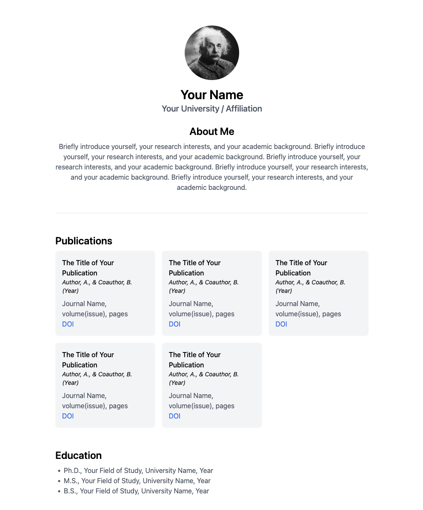

# minimal-academic-website

A minimalist academic webpage built using only ~100 lines of HTML code. Check out the demo website [here](https://onpix.github.io/minimal-academic-website/).

If you find this template useful, please consider giving this repo a star, or linking back to this repository from your webpage.
